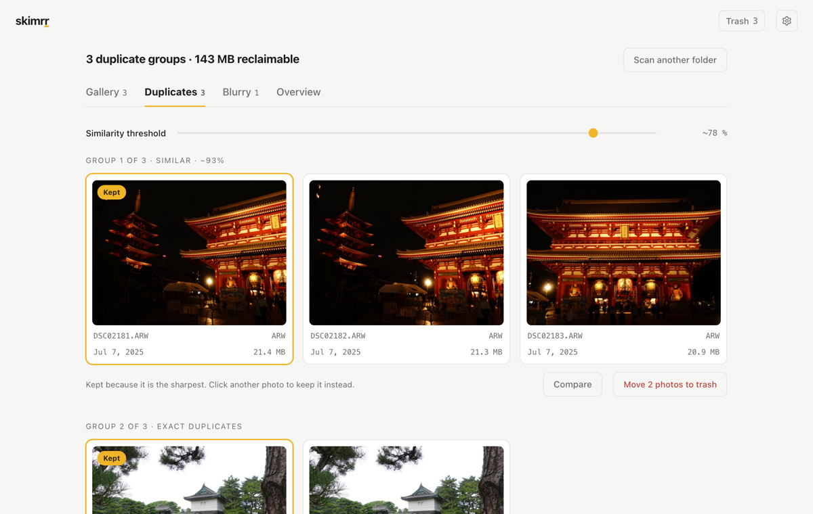

# Skimrr



Finds the duplicates and the blurry shots in a photo library, entirely on the
machine. Two detections, not ten: the rest of the sorting stays with the
photographer. Native app (Tauri 2, Rust core), for macOS and Windows, translated
into six languages, with an on-device vision model reviewing every match and an
automated test suite covering the whole detection pipeline.

[skimrr.com](https://skimrr.com) · [Download](https://skimrr.com/download) · macOS · Windows

**100% local.** No photo, no metadata ever leaves the machine. No account, no
telemetry. The app only asks for access to the folder you pick. Only licence
activation touches the network: once, then roughly once a month, and never with
anything read from your photos.

## How it works

**Duplicates.** Files of identical size are hashed with SHA-256 (in parallel):
files sharing a hash are exact copies. In parallel, every image is decoded once to
extract a 64-bit perceptual hash (dHash), which catches cropped, recompressed or
lightly edited versions of the same shot. Grouping runs on union-find, with a
similarity threshold adjustable live: moving the slider never re-runs the scan, it
only re-groups the existing fingerprints.

**Blur.** Sharpness score by Laplacian variance, no AI, no GPU. The image is split
into 64px tiles and **the score is the sharpest tile's**: a photo passes as soon as
*something* in it is in focus. Averaging over the whole frame says the opposite and
wrongly flags portraits shot against a blurred background. On a test bokeh shot,
the whole-frame average fell to 16% of a sharp photo's score, against 47% by tile.
A percentile approach was tried and dropped: a subject occupying a tenth of the
frame doesn't cover enough tiles to clear it, which is exactly the case that
matters.

Because the score depends on content, the threshold isn't a constant: it's
calibrated on the scanned folder's own median (`median × 0.25`). The tab shows a
per-thumbnail sharpness gauge relative to that median, and keeps on screen the
photos sitting **just above the threshold** — the hard part of any threshold is
seeing what it drops by a hair.

**Guide.** On first launch, a three-point screen explains what Skimrr looks for,
what never leaves the machine, and how deletions work. It doesn't come back after
that, and stays reachable from the "?" in the topbar.

**Viewer.** A zoom button appears on hover over any thumbnail and opens the photo
full-screen, with its metadata and sharpness score. Arrow keys step through the
group (or the blurry-photo selection), Escape closes, and from a duplicate group
you can designate the keeper without backing out first. The viewer's background
stays a dark neutral in both themes: a light surround throws off contrast reading,
which is exactly what's being judged.

Zoom works via scroll wheel, double-click or the `+`/`-` keys, panning is
click-and-drag, and `0` resets. The percentage shown is of **real pixels**, not the
fitted size: clicking it jumps straight to 1:1, and past 100% the image is
interpolated — there's nothing more to see. For raw and HEIC files, a full-resolution
rendition is generated on first open rather than at scan time, since a whole library
would cost far more than the handful of photos actually examined. A raw's detail
ceiling stays whatever rendition it embeds (1920px on the ARW files tested):
going further would require full demosaicing.

**Trash.** No silent permanent deletion. Photos first go through a review grid —
every one is seen before anything moves, and any can be pulled out of the batch
with one click. They're then moved to a local, timestamped trash folder with a
manifest that restores them to their exact original location. The move is all or
nothing: if one file fails, the whole batch is put back. Only explicitly emptying
the trash deletes anything for real.

## Developing

```sh
npm install
npm run tauri dev      # runs the app
npm run build           # type-checks and builds the frontend
cargo test               # (inside src-tauri/) backend tests
npm run tauri build     # builds the distributable package
```

The detection pipeline (hashing, perceptual fingerprinting, blur scoring,
raw/JPEG pairing) is covered by an automated test suite that runs before every
release.

## Stack

Tauri 2 + React + TypeScript. The Rust backend does the scanning, hashing and
image analysis (`walkdir`, `rayon`, `sha2`, `image`, `kamadak-exif`); the frontend
only handles display. Interface in six languages (English, French, Spanish,
German, Japanese, Simplified Chinese) via react-i18next, with embedded fonts:
Schibsted Grotesk, Spline Sans Mono and Noto Sans JP/SC, subsetted to the
interface's own character set.

## Formats

JPEG, PNG, HEIC/HEIF, WebP, GIF, BMP, TIFF and the main raw formats (ARW, CR2,
CR3, NEF, ORF, RW2, RAF, PEF, DNG…) are fully analysed: exact duplicates,
near-duplicates and sharpness alike.

HEIC, the default iPhone format, goes through a pure-Rust HEVC decoder (the `heic`
crate): no system library to install.

Raw files are read through the **full-size JPEG rendition** their container
embeds, far faster than demosaicing, and faithful to what the photographer saw at
the time. Watch the trap: sensor data routinely contains `FF D8 FF` byte
sequences, so a candidate is only accepted once its JPEG header actually parses —
picking the largest byte block instead yields a corrupted image.

Neither the macOS webview nor WebView2 can display a raw file, and Chromium
doesn't read HEIC: these files get a cached JPEG thumbnail
(`app_cache_dir/previews`) that the interface shows in place of the original.

A raw's sensor size lives in vendor tags that Sony, notably, doesn't expose, so
the interface shows the **format** ("ARW") instead of misleading dimensions. A
raw is always preferred over its JPEG export when suggesting which version to
keep.

## Orientation

A camera records the photo in the sensor's own orientation and notes in an EXIF
tag how the body was held. Browsers honour that tag for files they load
themselves, but the thumbnails Skimrr encodes (raw, HEIC) are written without
EXIF, so rotation is baked in directly. The tag is also read for raw containers,
Sony's included, which don't go through the generic EXIF reader.

Rotation is applied **before** computing the perceptual fingerprint and sharpness
score — otherwise a raw portrait would never group with its straightened export:
two orientations produce two unrelated fingerprints.

## Known limits

- **Capture date**: read from EXIF when present, otherwise the file's
  modification date.
- **Large libraries**: perceptual-fingerprint comparison is quadratic; past a few
  tens of thousands of photos, a dedicated index will become necessary.
- **Linux**: WebKitGTK rendering hasn't been tested yet.

## Licence

Source shown for transparency, all rights reserved: no reuse, modification or
redistribution without permission. See [LICENSE](LICENSE). To use Skimrr,
[download the app](https://skimrr.com/download).
